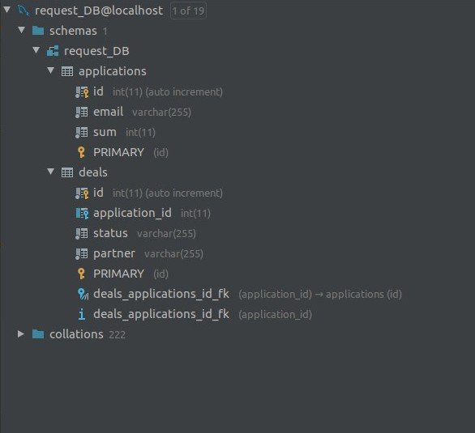

Requirements: Code editor with Apache 2.4, PHP 7.3, MariaDB 10.3. (LAMP STACK)

How to run this project:
 
0. Clone this project to your local system
1. Set up the necessary database  connection data, DataBaseManager file located in the core\Database folder
2. Then input your mailing credentials inside mailer.php located in the main directory
3. To install all the required packages - run console command: composer install, then composer dump-autoload 
4. Launch a local server: php -S localhost:8000
5. /  - route is used to make deal requests, /status - route let's you input Deal ID, change the status.

